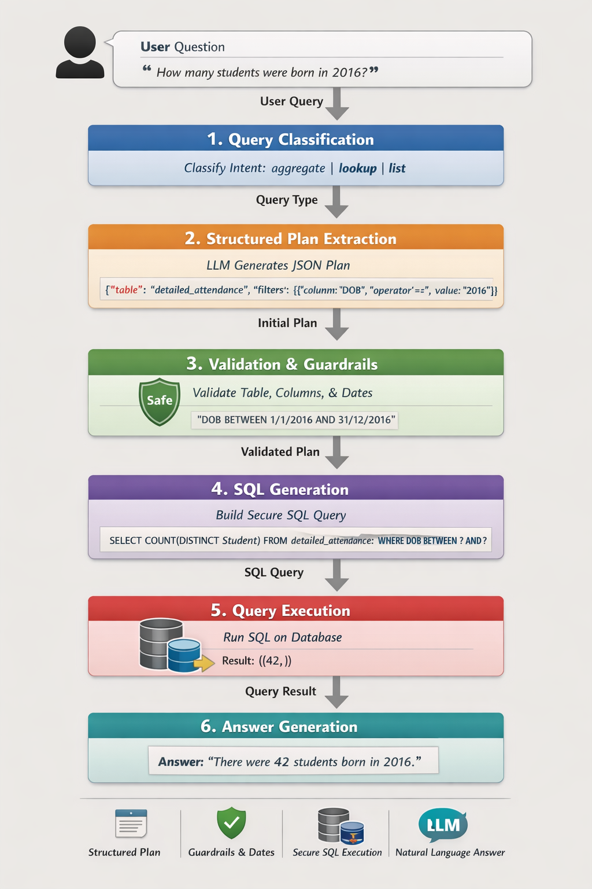

# 🎓 Student Attendance Database QA System

Natural Language → Guardrailed SQL Assistant

A structured, safe, and deterministic Question Answering system that converts natural language into validated SQL queries.

Built with:

Streamlit (UI)

LangChain + Ollama (LLM reasoning layer)

SQLite (Local database)

Multi-layer guardrailed SQL pipeline

# 📌 System Daigram


# 📌 System Overview

User Question
→ Query Classification (LLM)
→ Structured Plan Extraction (LLM → JSON)
→ Validation & Guardrails (Deterministic)
→ SQL Builder (Deterministic)
→ SQLite Execution
→ Natural Language Answer (LLM)

The LLM is never allowed to execute SQL directly.
All SQL is validated, parameterized, and deterministic.


🧠 Architecture
```text
USER (Streamlit UI)
        │
        ▼
run_query(user_input)
        │
        ▼
LAYER 1 — classify_query()      ✅ LLM
→ Detects intent (aggregate | list | lookup)

        ▼
LAYER 2 — extract_plan()        ✅ LLM
→ Generates structured JSON:
  {
    table,
    select_column,
    aggregation,
    filters
  }

        ▼
LAYER 3 — validate_plan()       ❌ No LLM
→ Table whitelist
→ Column whitelist
→ Type enforcement
→ Date normalization
→ Range → BETWEEN conversion
→ Operator correction
→ LIKE removal for date fields

        ▼
LAYER 4 — build_sql()           ❌ No LLM
→ Deterministic SQL builder
→ Parameterized queries
→ Safe JOIN handling

        ▼
EXECUTE (SQLite)                ❌ No LLM

        ▼
LAYER 5 — generate_answer()     ✅ LLM
→ Converts result rows into natural language
```

# 🗄 Database Tables
## 1️⃣ detailed_attendance

Session-level attendance records.

Key columns:

Student

SIMS_ID

DOB

DOA

Gender

Mark

Mark_date

AM_PM

Year_taught_in_Code

Key_Stage

Reg

## 2️⃣ attendance_summary

Year-level aggregated totals per student.

Includes:

Present

Illness

Authorised absence

Late

Unauthorised absence

Grand_Total

## 3️⃣ attendance_mark_description

Reference table for attendance codes.

Columns:

Reg_Codes

Description

Statistical_Meaning

Physical_Meaning

Status

## ❓ Supported Question Types
🔹 Record Lookup

What is the date of birth of Arjan Jha Crasto?

What is the admission date of SIMS ID 12345?

🔹 Aggregate Queries

How many students were born in March 2016?

Count illness marks.

How many students are in Year 3?

🔹 Attribute Lookup

What does mark code C mean?

🔹 List Queries

List students in Year 4.

Show students admitted in 2022.

# 🚀 Setup & Run Instructions
1️⃣ Install Ollama

Download and install:

https://ollama.com

Verify installation:

ollama --version


Pull required model (example: llama3):

ollama pull llama3


Test model:

ollama run llama3

2️⃣ Clone Project
git clone <your-repo-url>
cd student-attendance-qa

3️⃣ Create Virtual Environment (Recommended)
python -m venv venv


Activate:

Windows

venv\Scripts\activate


Mac/Linux

source venv/bin/activate

4️⃣ Install Requirements

Make sure you have a requirements.txt file, then run:

pip install -r requirements.txt

5️⃣ Run the Application

If using Streamlit:

streamlit run app.py


If using CLI script:

python main.py

📁 Example requirements.txt
streamlit
langchain
langchain-community
ollama
sqlite3
pydantic

🔒 Security Design

No raw SQL from LLM

Strict table & column whitelist

Parameterized queries

Deterministic SQL builder

Date range normalization

Operator correction

Guardrail validation before execution

🧪 Example Query

User asks:

How many students were born in March 2016?

Generated SQL:

SELECT COUNT(DISTINCT DOB)
FROM detailed_attendance
WHERE DOB BETWEEN ? AND ?;

# 📌 Key Principles

LLM for reasoning only

Deterministic SQL execution

Guardrailed architecture

Safe parameter binding

Modular layered pipeline

# 📜 License

MIT License

If you need help extending the system (range logic, joins, advanced filters, multi-table queries), you can expand the validation and SQL builder layers without modifying the LLM logic.